# Consultas_1_SQL
introduccion a las consultas a una BD usando el lenguaje SQL

## Base de datos: Ventas
## Tabla: Cliente

## Instruccion SELECT
- permite seleccionar datos de una tabla.
- su formato es: 'SELECT CAMPOS_tabla FROM nombre tabla``

## Consulta N°  1
1.Para visualizar toda la información que contiene la tabla Cliente se puede incluir con la introducción SELECT el caracter **\*** o cada uno de los campos de la tabla.

- `SELECT * FROM Cliente'
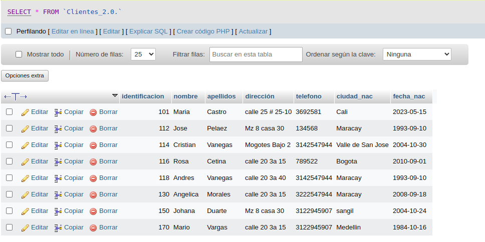
- `SELECT identificacion. nombre, apellidos, direccion. telefono,ciudad nac, fecha nac FROM Cliente´
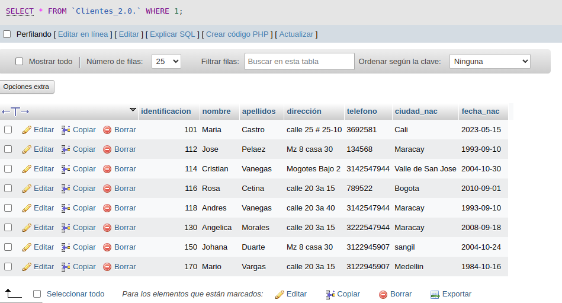

### Consulta No. 2

2. Para visualizar solamente la identificacion del cliente: - `SELECT identificacion. FROM Cliente`

### Consulta No. 3

3. si desea obtener los registros cuya identificacion sea mayor o igual a 150, se debe utilizar la clausula `WHERE` que especifi las condiciones que deben reunir los registros que se van a seleccionar: `SELECT * FROM Cliente WHERE identificacion>=150'
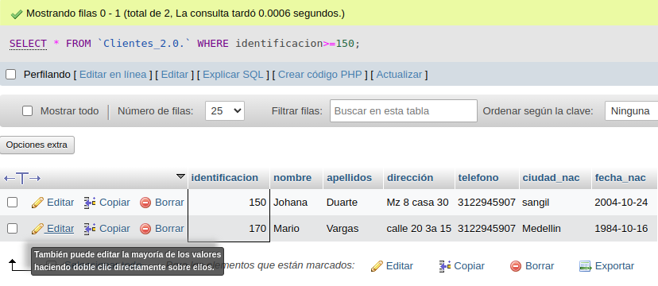

### Consulta No.4

4. se desea obtener los registros cuyos apellidos sean Vanegas o Celina, se debe utilizar el operador `IN` Que especifica los registros de una tabla. 

`SELECT apellidos FROM cliente WHERE apellidos IN('vanegas', 'celina')`

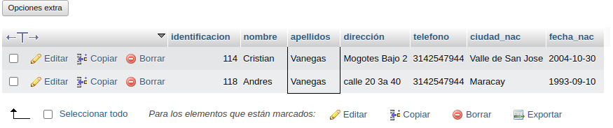

O se puede utilizar el operador `OR`

`SELECT apellidos FROM cliente WHERE apellidos ='vanegas'OR apellidos = 'celina'`

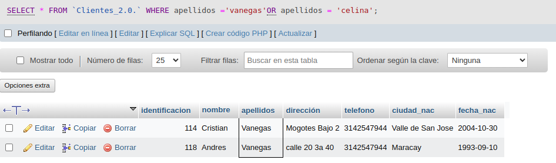

### Consulta No. 5

5. Se desea obtener los registros cuya ciudad identificacion sea menor de 110 y la ciudad sea Cali, se debe utilizar el operador `AND`

`SELECT * FROM CLiente WHERE identificacion<=110 AND ciudad_nac  = 'Cali'`

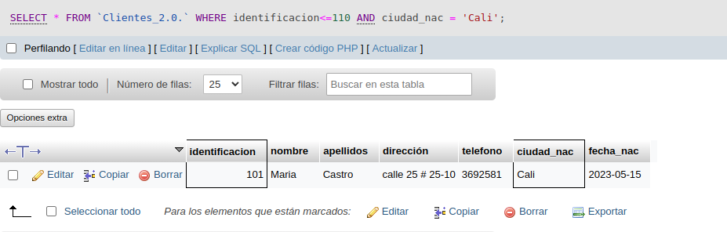

### Consulta No. 6

6. Si se desea obtener los registros cuyos nombres empiecen con la letra 'A', se debe utilizar el operador `LIKE` que utiliza los patrones `%` (todos) y caracter `_` (caracter).

`SELECT * FROM Cliente WHERE nombre LIKE 'A%'`

### Consulta No. 7

7. Se desea obtener los registros cuyos nombres contengan la letra 'a'

`SELECT * FROM Cliente WHERE nombre LIKE '%a%'`

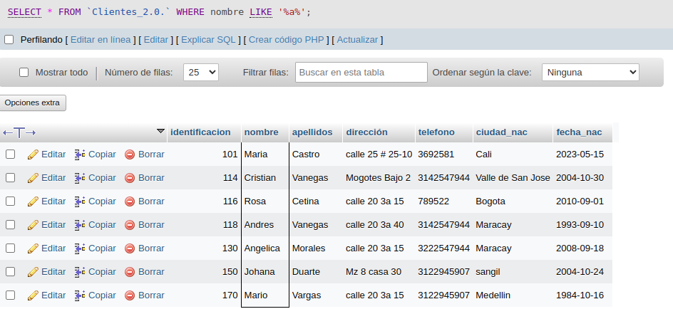

### Consulta No. 8

8. Se desea obtener los registros donde la cuarta letra del nombre del cliente sea la letra 'a'

`SELECT * FROM Cliente WHERE nombre LIKE '___a'`

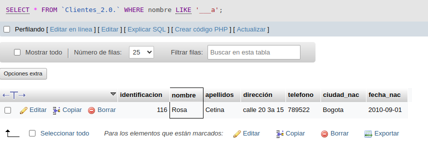

### Consulta No. 9

9. Si se desea obtener los registros cuya identificacion este entre el intervalo 110 y 150; se debe utilizar la clausula `BETWEEN`, Que sirve para especificar un intervalo de valores

`SELECT * FROM Cliente WHERE identificion BETWEEN 110 AND 150`

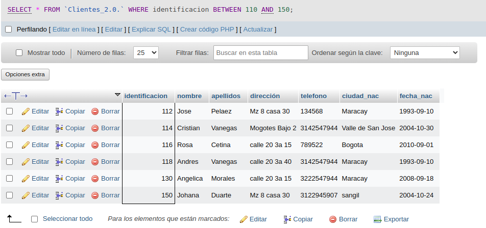

## Intrusccion DELETE
- Permite seleccionar datos de una tabla.
-Su formato es: `DELETE FROM nombre_tabla`

### Eliminacion No. 1

1. Eliminar los registros cuya identificacion sea mayor de 170

`DELETE FROM Cliente WHERE Identificacion = 170`

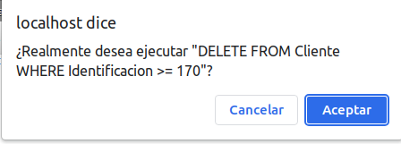

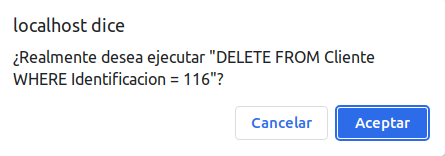

2. Eliminar los registros cuya id sea igual a 116

## Instruccion UPDATE
- Actualizar un campo de la tabla
- El formato es: `UPDATE nombre_tabla SET nombre_campo = valor`