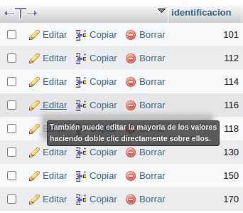

# Consultas_1_SQL
introduccion a las consultas a una BD usando el lenguaje SQL

## Base de datos: Ventas
## Tabla: Cliente

## Instruccion SELECT
- permite seleccionar datos de una tabla.
- su formato es: 'SELECT CAMPOS_tabla FROM nombre tabla``

## Consulta N°  1
1.Para visualizar toda la información que contiene la tabla Cliente se puede incluir con la introducción SELECT el caracter **\*** o cada uno de los campos de la tabla.

- `SELECT * FROM Cliente'

- `SELECT identificacion. nombre, apellidos, direccion. telefono,ciudad nac, fecha nac FROM Cliente´

### Consulta No. 2

2. Para visualizar solamente la identificacion del cliente: - `SELECT identificacion. FROM Cliente`

### Consulta No. 3

3. si desea obtener los registros cuya identificacion sea mayor o igual a 150, se debe utilizar la clausula `WHERE` que especifi las condiciones que deben reunir los registros que se van a seleccionar: `SELECT * FROM Cliente WHERE identificacion>=150'

